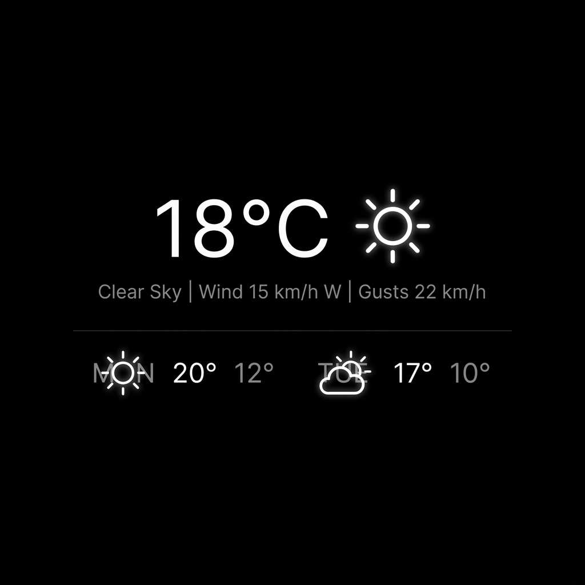

# mirrordash-weather

Weather forecast widget for MirrorDash. Displays current conditions and a configurable-length daily forecast strip using one of four weather provider APIs.

## Features
- Supports SMHI Open Data, Open-Meteo, WeatherAPI.com, and OpenWeatherMap APIs.
- Displays wind speed, precipitation, and multi-day daily forecasts.
- Automatically reads coordinate, timezone, unit, and language settings from global configuration.

## Installation

```bash
uv pip install -e .
```

## Screenshot



## License
[PolyForm Noncommercial License 1.0.0](LICENSE.md)
